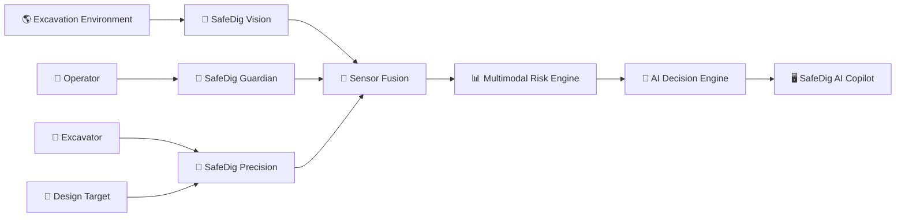

<div align="center">

# 🚜 SafeDig AI Copilot

### Intelligent Excavation Safety & Decision Support System


<br>


</div>

---

<div align="center">

## 🚧 Live Excavation Simulation


### `SENSE → UNDERSTAND → ANALYZE → WARN → ASSIST`

</div>

---

## 📌 Overview

**SafeDig AI Copilot** adalah prototype sistem kecerdasan buatan multimodal untuk membantu
meningkatkan keselamatan, presisi, dan situational awareness pada operasi excavator.

Sistem menggabungkan informasi dari beberapa subsystem seperti:

- 📡 **SafeDig Vision** — subsurface / simulated GPR awareness
- 🎯 **SafeDig Precision** — depth & digging control
- 👷 **SafeDig Guardian** — operator awareness monitoring
- 🔗 **Sensor Fusion** — multimodal data fusion
- 📊 **Risk Engine** — risk interpretation
- 🧠 **Decision Engine** — AI-assisted recommendation

> **SEE BELOW • DIG RIGHT • STAY ALERT**

---

## ⚡ System Status

| Module | Status |
|---|:---:|
| 📡 Vision | 🟢 ACTIVE |
| 🎯 Precision | 🟢 ACTIVE |
| 👷 Guardian | 🟢 ACTIVE |
| 🔗 Fusion | 🟢 ACTIVE |
| 📊 Risk Engine | 🟢 ACTIVE |
| 🧠 Decision Engine | 🟢 ACTIVE |

---

## 🧠 System Architecture



---

## 📡 SafeDig Vision

SafeDig Vision menyediakan awareness terhadap kondisi bawah permukaan.

```text
Utility Estimate
Estimated Depth
Distance From Bucket
Detection Confidence
GPR Scan Visualization
```

Prototype saat ini dapat menggunakan **simulated GPR data** untuk kebutuhan
demonstrasi, UI testing, dan pengembangan.

---

## 🎯 SafeDig Precision

SafeDig Precision memonitor kondisi penggalian terhadap target desain.

```text
Target Depth
Current Depth
Remaining Depth
Bucket Speed
Design Conflict
Safe Envelope
```

Contoh:

```text
Target Depth     : 1.50 m
Current Depth    : 0.20 m
Remaining        : 1.30 m
Bucket Speed     : 0.00 m/s
Design Conflict  : NO
```

---

## 👷 SafeDig Guardian

SafeDig Guardian merupakan subsystem eksperimen untuk operator awareness monitoring.

```text
Fatigue Score
Attention Level
Operator Status
Guardian Confidence
```

> SafeDig Guardian adalah prototype estimation system dan bukan perangkat medis.

---

## 🔗 Multimodal Sensor Fusion

SafeDig tidak hanya membaca satu sumber informasi.

```text
VISION ───────┐
              │
PRECISION ────┼──► SENSOR FUSION ─► RISK ENGINE ─► DECISION ENGINE
              │
GUARDIAN ─────┘
```

Sensor Fusion dapat menggabungkan:

- subsurface detection,
- machine position,
- current depth,
- target depth,
- operator awareness,
- design constraints,
- scenario state,
- sensor confidence.

---

## 📊 AI Risk Engine

Risk Engine menginterpretasikan kondisi sistem secara keseluruhan.

```text
0 ─────────────────────────────────────── 100

SAFE              WARNING             CRITICAL
```

Contoh output:

```text
Risk Score        : 3 / 100
Fusion Confidence : HIGH
System Condition  : SAFE
```

---

## 🧠 AI Copilot Decision Engine

Decision Engine menghasilkan rekomendasi berdasarkan data yang tersedia.

| State | Meaning |
|:---:|---|
| 🟢 NORMAL | Operasi normal |
| 🟡 CAUTION | Membutuhkan perhatian |
| 🟠 WARNING | Risiko meningkat |
| 🔴 STOP | Potensi kondisi kritis |

Contoh:

```text
AI COPILOT DECISION

● NORMAL

NORMAL OPERATION

Reason:
NO ACTIVE SAFETY CONFLICT
IN AVAILABLE INPUTS
```

---

## 🚜 Excavation Intelligence

Visualisasi utama SafeDig dapat menampilkan:

```text
Excavator Position
Boom / Arm / Bucket Motion
Ground Surface
Current Depth
Target Depth
Safe Envelope
Excavation Zone
Utility Estimate
Risk State
```

Animasi di bagian atas README menunjukkan contoh sederhana satu siklus:

```text
IDLE
  ↓
LOWER BUCKET
  ↓
DIG
  ↓
LIFT SOIL
  ↓
RETURN
```

---

## 🎬 Operating Modes

### 🔵 Demo Mode

Digunakan untuk:

- simulation,
- algorithm testing,
- UI testing,
- safety scenario demonstration,
- research,
- client presentation.

### 🟢 Live Mode

Disiapkan sebagai jalur integrasi sumber data nyata seperti:

```text
Camera
GPR
GNSS / GPS
IMU
Depth Sensor
Bucket Position Sensor
Machine Telemetry
CAN Bus
Machine Control Unit
```

---

## 📁 Project Structure

```text
XCMG_SafeDig_AI_Copilot/
│
├── main.py
├── requirements.txt
├── README.md
├── .gitignore
│
├── assets/
│   └── excavator-animation.gif
│
├── config/
│   ├── settings.py
│   ├── risk_config.py
│   └── simulation_config.py
│
├── core/
│   ├── app_controller.py
│   ├── sensor_fusion.py
│   ├── risk_engine.py
│   ├── safe_envelope.py
│   └── decision_engine.py
│
└── modules/
    ├── safedig_vision/
    ├── safedig_precision/
    └── safedig_guardian/
```

---

## ⚙️ Installation

### 1. Clone Repository

```bash
git clone <YOUR_REPOSITORY_URL>
cd XCMG_SafeDig_AI_Copilot
```

### 2. Create Virtual Environment

```bash
python -m venv .venv
```

Windows:

```bash
.venv\Scripts\activate
```

Linux / macOS:

```bash
source .venv/bin/activate
```

### 3. Install Dependencies

```bash
pip install -r requirements.txt
```

### 4. Run

```bash
python main.py
```

---

## 🛡️ Safety Philosophy

SafeDig dikembangkan dengan prinsip:

**Detect Early**  
Mendeteksi potensi hazard sedini mungkin.

**Understand Context**  
Menggabungkan beberapa sumber informasi sebelum menghasilkan rekomendasi.

**Assist — Not Replace**  
AI membantu operator, bukan menggantikan operator.

**Human in Command**  
Keputusan operasional akhir tetap berada pada operator dan prosedur keselamatan yang berlaku.

---

## 🚧 Development Roadmap

```text
CORE ARCHITECTURE          ✅
VISION SYSTEM              ✅
PRECISION SYSTEM           ✅
SENSOR FUSION              ✅
RISK ENGINE                ✅
DECISION ENGINE            ✅
GUARDIAN PROTOTYPE         ✅
UI / UX OPTIMIZATION       🚧
COMPUTER VISION            🔬
REAL SENSOR INTEGRATION    🔬
FIELD VALIDATION           🔬
```

---

## ⚠️ Prototype Disclaimer

> **SafeDig AI Copilot is currently a research and development prototype.**

Current simulation results, utility estimates, fatigue indicators, depth values,
risk scores, and AI recommendations are not certified measurements.

Real-world deployment would require appropriate:

- sensor validation,
- calibration,
- field testing,
- fail-safe engineering,
- redundancy,
- cybersecurity review,
- functional safety assessment,
- operator validation,
- hardware integration,
- industrial certification.

---

<div align="center">

# 🚜 SafeDig AI Copilot


## `SEE BELOW • DIG RIGHT • STAY ALERT`

**AI × Heavy Equipment × Safety Engineering**

<br>


</div>
