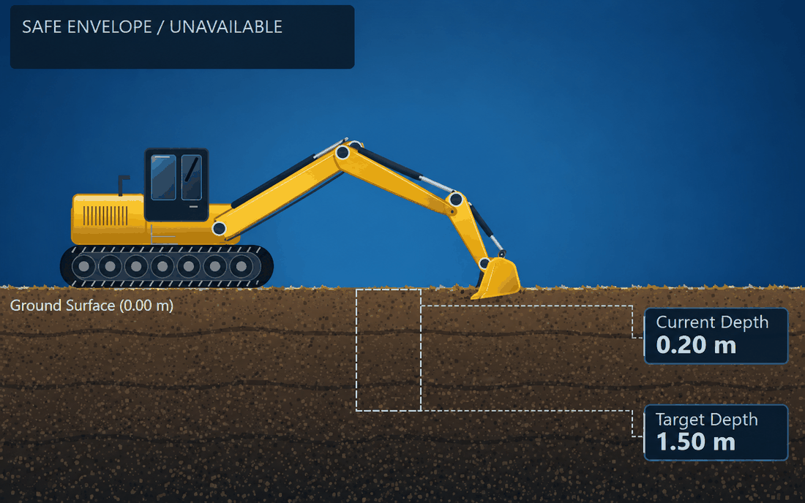

<!-- =========================================================
     SAFEDIG AI COPILOT
     Professional GitHub README
     ========================================================= -->

<div align="center">

# 🚜 SafeDig AI Copilot

### Intelligent Excavation Safety & Decision Support System


<br><br>


<br>

**Research • Engineering • Artificial Intelligence • Heavy Equipment Technology**

</div>

---

<div align="center">

## 🚧 SafeDig Excavation Intelligence

<!--
=============================================================
EXCAVATOR ANIMATION

Place your GIF file here:

assets/excavator-animation.gif

Recommended:
- Resolution: 1200 x 450
- Dark/navy background
- Side-view excavator
- Bucket digging animation
- HUD / sensor visualization
- Smooth loop
=============================================================
-->



### `SENSE → UNDERSTAND → PREDICT → WARN → ASSIST`

</div>

---

# 🛰️ SafeDig AI Copilot

**SafeDig AI Copilot** adalah prototype sistem kecerdasan buatan multimodal yang dikembangkan
untuk membantu meningkatkan:

- keselamatan penggalian,
- presisi excavator,
- awareness terhadap utilitas bawah tanah,
- monitoring operator,
- analisis risiko,
- dan pengambilan keputusan operasional.

Sistem menggabungkan beberapa sumber data ke dalam sebuah **AI Sensor Fusion Pipeline**
kemudian menerjemahkannya menjadi informasi keselamatan yang mudah dipahami operator.

> SafeDig dirancang sebagai **AI Decision Support System**, bukan sebagai pengganti operator.

---

<div align="center">

## ⚡ SYSTEM STATUS

| MODULE | STATUS |
|:---:|:---:|
| 📡 VISION | 🟢 ACTIVE |
| 🎯 PRECISION | 🟢 ACTIVE |
| 👷 GUARDIAN | 🟢 ACTIVE |
| 🔗 SENSOR FUSION | 🟢 ACTIVE |
| 📊 RISK ENGINE | 🟢 ACTIVE |
| 🧠 DECISION ENGINE | 🟢 ACTIVE |

### 🟢 SYSTEM ONLINE

</div>

---

# 🎯 Project Mission

SafeDig dikembangkan untuk menjawab sebuah pertanyaan:

> **Bagaimana AI dapat membantu excavator memahami lingkungan kerjanya sebelum risiko berubah menjadi insiden?**

SafeDig mencoba membangun pendekatan:

```text
                    REAL WORLD
                        │
                        ▼
              ┌──────────────────┐
              │     SENSING      │
              └────────┬─────────┘
                       │
                       ▼
              ┌──────────────────┐
              │  UNDERSTANDING   │
              └────────┬─────────┘
                       │
                       ▼
              ┌──────────────────┐
              │    AI FUSION     │
              └────────┬─────────┘
                       │
                       ▼
              ┌──────────────────┐
              │  RISK ANALYSIS   │
              └────────┬─────────┘
                       │
                       ▼
              ┌──────────────────┐
              │    DECISION      │
              └────────┬─────────┘
                       │
                       ▼
              ┌──────────────────┐
              │ OPERATOR ASSIST  │
              └──────────────────┘